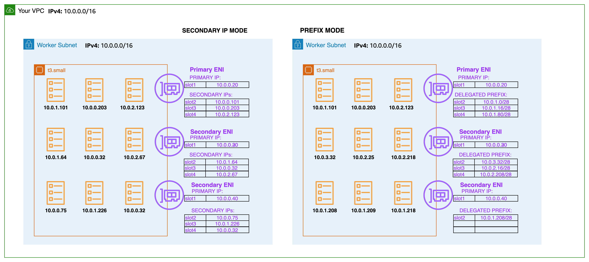
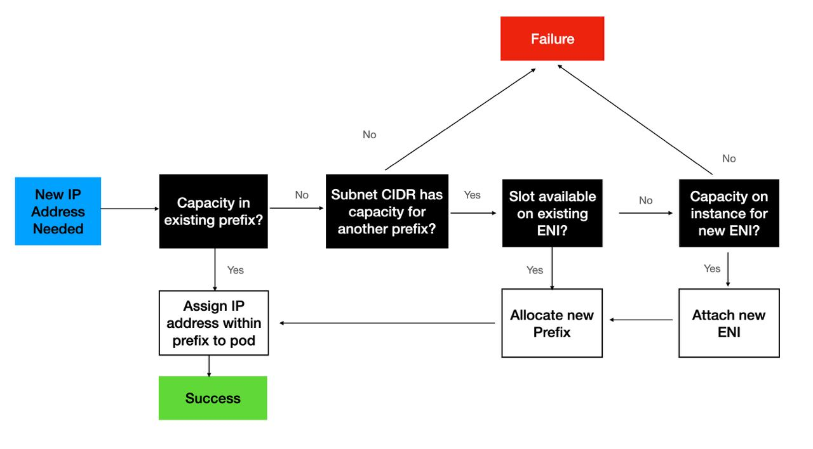

!!! info "We've Moved to the AWS Docs! 🚀"
    This content has been updated and relocated to improve your experience. 
    Please visit our new site for the latest version:
    [AWS EKS Best Practices Guide](https://docs.aws.amazon.com/eks/latest/best-practices/prefix-mode-linux.html) on the AWS Docs

    Bookmarks and links will continue to work, but we recommend updating them for faster access in the future.

---

# Prefix Mode for Linux

Amazon VPC CNI assigns network prefixes to [Amazon EC2 network interfaces](https://docs.aws.amazon.com/AWSEC2/latest/UserGuide/ec2-prefix-eni.html) to increase the number of IP addresses available to nodes and increase pod density per node. You can configure version 1.9.0 or later of the Amazon VPC CNI add-on to assign IPv4 and IPv6 CIDRs instead of assigning individual secondary IP addresses to network interfaces. 

Prefix mode is enabled by default on IPv6 clusters and is the only option supported. The VPC CNI assigns a /80 IPv6 prefix to a slot on an ENI. Please refer to the [IPv6 section of this guide](../ipv6/index.md) for further information. 

With prefix assignment mode, the maximum number of elastic network interfaces per instance type remains the same, but you can now configure Amazon VPC CNI to assign /28 (16 IP addresses) IPv4 address prefixes, instead of assigning individual IPv4 addresses to the slots on network interfaces. When `ENABLE_PREFIX_DELEGATION` is set to true VPC CNI allocates an IP address to a Pod from the prefix assigned to an ENI.  Please follow the instructions mentioned in the [EKS user guide](https://docs.aws.amazon.com/eks/latest/userguide/cni-increase-ip-addresses.html) to enable Prefix IP mode. 



The maximum number of IP addresses that you can assign to a network interface depends on the instance type. Each prefix that you assign to a network interface counts as one IP address. For example, a `c5.large` instance has a limit of `10` IPv4 addresses per network interface. Each network interface for this instance has a primary IPv4 address. If a network interface has no secondary IPv4 addresses, you can assign up to 9 prefixes to the network interface. For each additional IPv4 address that you assign to a network interface, you can assign one less prefix to the network interface. Review the AWS EC2 documentation on [IP addresses per network interface per instance type](https://docs.aws.amazon.com/AWSEC2/latest/UserGuide/using-eni.html#AvailableIpPerENI) and [assigning prefixes to network interfaces.](https://docs.aws.amazon.com/AWSEC2/latest/UserGuide/ec2-prefix-eni.html)

During worker node initialization, the VPC CNI assigns one or more prefixes to the primary ENI. The CNI pre-allocates a prefix for faster pod startup by maintaining a warm pool. The number of prefixes to be held in warm pool can be controlled by setting environment variables.

* `WARM_PREFIX_TARGET`, the number of prefixes to be allocated in excess of current need.
* `WARM_IP_TARGET`, the number of IP addresses to be allocated in excess of current need.
* `MINIMUM_IP_TARGET`, the minimum number of IP addresses to be available at any time.
* `WARM_IP_TARGET` and `MINIMUM_IP_TARGET` if set will override `WARM_PREFIX_TARGET`.

As more Pods scheduled additional prefixes will be requested for the existing ENI. First, the VPC CNI attempts to allocate a new prefix to an existing ENI. If the ENI is at capacity, the VPC CNI attempts to allocate a new ENI to the node. New ENIs will be attached until the maximum ENI limit (defined by the instance type) is reached. When a new ENI is attached, ipamd will allocate one or more prefixes needed to maintain the `WARM_PREFIX_TARGET`, `WARM_IP_TARGET`, and `MINIMUM_IP_TARGET` setting.




## Recommendations

### Use Prefix Mode when

Use prefix mode if you are experiencing Pod density issue on the worker nodes. To avoid VPC CNI errors, we recommend examining the subnets for contiguous block of addresses for /28 prefix before migrate to prefix mode. Please refer “[Use Subnet Reservations to Avoid Subnet Fragmentation (IPv4)](https://docs.aws.amazon.com/vpc/latest/userguide/subnet-cidr-reservation.html)” section for Subnet reservation details. 

For backward compatibility, the [max-pods](https://github.com/awslabs/amazon-eks-ami/blob/master/files/eni-max-pods.txt) limit is set to support secondary IP mode. To increase the pod density, please specify the `max-pods` value to Kubelet and `--use-max-pods=false` as the user data for the nodes. You may consider using the [max-pod-calculator.sh](https://github.com/awslabs/amazon-eks-ami/blob/master/files/max-pods-calculator.sh) script to calculate EKS’s recommended maximum number of pods for a given instance type. Refer to the EKS [user guide](https://docs.aws.amazon.com/eks/latest/userguide/cni-increase-ip-addresses.html) for example user data.

```
./max-pods-calculator.sh --instance-type m5.large --cni-version ``1.9``.0 --cni-prefix-delegation-enabled
```


Prefix assignment mode is especially relevant for users of [CNI custom networking](https://docs.aws.amazon.com/eks/latest/userguide/cni-custom-network.html) where the primary ENI is not used for pods. With prefix assignment, you can still attach more IPs on nearly every Nitro instance type, even without the primary ENI used for pods.

### Avoid Prefix Mode when

If your subnet is very fragmented and has insufficient available IP addresses to create /28 prefixes, avoid using prefix mode. The prefix attachment may fail if the subnet from which the prefix is produced is fragmented (a heavily used subnet with scattered secondary IP addresses). This problem may be avoided by creating a new subnet and reserving a prefix.

In prefix mode, the security group assigned to the worker nodes is shared by the Pods. Consider using [Security groups for Pods](../sgpp/index.md)if you have a security requirement to achieve compliance by running applications with varying network security requirements on shared compute resources.

### Use Similar Instance Types in the same Node Group

Your node group may contain instances of many types. If an instance has a low maximum pod count, that value is applied to all nodes in the node group. Consider using similar instance types in a node group to maximize node use. We recommend configuring [node.kubernetes.io/instance-type](https://karpenter.sh/docs/concepts/nodepools/) in the requirements part of the provisioner API if you are using Karpenter for automated node scaling.

!!! warning 
    The maximum pod count for all nodes in a particular node group is defined by the *lowest* maximum pod count of any single instance type in the node group.

### Configure `WARM_PREFIX_TARGET` to conserve IPv4 addresses

The [installation manifest’s](https://github.com/aws/amazon-vpc-cni-k8s/blob/master/config/v1.9/aws-k8s-cni.yaml#L158) default value for `WARM_PREFIX_TARGET` is 1. In most cases, the recommended value of 1 for `WARM_PREFIX_TARGET` will provide a good mix of fast pod launch times while minimizing unused IP addresses assigned to the instance.

If you have a need to further conserve IPv4 addresses per node use `WARM_IP_TARGET` and `MINIMUM_IP_TARGET` settings, which override `WARM_PREFIX_TARGET` when configured. By setting `WARM_IP_TARGET` to a value less than 16, you can prevent the CNI from keeping an entire excess prefix attached.

### Prefer allocating new prefixes over attaching a new ENI

Allocating an additional prefix to an existing ENI is a faster EC2 API operation than creating and attaching a new ENI to the instance. Using prefixes improves performance while being frugal with IPv4 address allocation. Attaching a prefix typically completes in under a second, whereas attaching a new ENI can take up to 10 seconds. For most use cases, the CNI will only need a single ENI per worker node when running in prefix mode. If you can afford (in the worst case) up to 15 unused IPs per node, we strongly recommend using the newer prefix assignment networking mode, and realizing the performance and efficiency gains that come with it.

### Use Subnet Reservations to Avoid Subnet Fragmentation (IPv4)

When EC2 allocates a /28 IPv4 prefix to an ENI, it has to be a contiguous block of IP addresses from your subnet. If the subnet that the prefix is generated from is fragmented (a highly used subnet with scattered secondary IP addresses), the prefix attachment may fail, and you will see the following error message in the VPC CNI logs:

```
failed to allocate a private IP/Prefix address: InsufficientCidrBlocks: There are not enough free cidr blocks in the specified subnet to satisfy the request.
```

To avoid fragmentation and have sufficient contiguous space for creating prefixes, you may use [VPC Subnet CIDR reservations](https://docs.aws.amazon.com/vpc/latest/userguide/subnet-cidr-reservation.html#work-with-subnet-cidr-reservations) to reserve IP space within a subnet for exclusive use by prefixes. Once you create a reservation, the VPC CNI plugin will call EC2 APIs to assign prefixes that are automatically allocated from the reserved space.

It is recommended to create a new subnet, reserve space for prefixes, and enable prefix assignment with VPC CNI for worker nodes running in that subnet. If the new subnet is dedicated only to Pods running in your EKS cluster with VPC CNI prefix assignment enabled, then you can skip the prefix reservation step.

### Avoid downgrading VPC CNI

Prefix mode works with VPC CNI version 1.9.0 and later. Downgrading of the Amazon VPC CNI add-on to a version lower than 1.9.0 must be avoided once the prefix mode is enabled and prefixes are assigned to ENIs. You must delete and recreate nodes if you decide to downgrade the VPC CNI.

### Replace all nodes during the transition to Prefix Delegation

It is highly recommended that you create new node groups to increase the number of available IP addresses rather than doing rolling replacement of existing worker nodes. Cordon and drain all the existing nodes to safely evict all of your existing Pods. To prevent service disruptions, we suggest implementing [Pod Disruption Budgets](https://kubernetes.io/docs/tasks/run-application/configure-pdb) on your production clusters for critical workloads. Pods on new nodes will be assigned an IP from a prefix assigned to an ENI. After you confirm the Pods are running, you can delete the old nodes and node groups. If you are using managed node groups, please follow steps mentioned here to safely [delete a node group](https://docs.aws.amazon.com/eks/latest/userguide/delete-managed-node-group.html).


