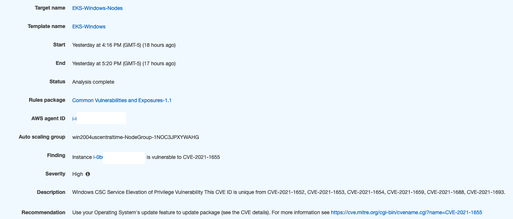

!!! info "We've Moved to the AWS Docs! 🚀"
    This content has been updated and relocated to improve your experience. 
    Please visit our new site for the latest version:
    [AWS EKS Best Practices Guide](https://docs.aws.amazon.com/eks/latest/best-practices/windows-hardening.html) on the AWS Docs

    Bookmarks and links will continue to work, but we recommend updating them for faster access in the future.

---

# Windows worker nodes hardening

OS Hardening is a combination of OS configuration, patching, and removing unnecessary software packages, which aim to lock down a system and reduce the attack surface. It is a best practice to prepare your own EKS Optimized Windows AMI with the hardening configurations required by your company. 

AWS provides a new EKS Optimized Windows AMI every month containing the latest Windows Server Security Patches. However, it is still the user's responsibility to harden their AMI by applying the necessary OS configurations regardless of whether they use self-managed or managed node groups.

Microsoft offers a range of tools like [Microsoft Security Compliance Toolkit](https://www.microsoft.com/en-us/download/details.aspx?id=55319) and [Security Baselines](https://docs.microsoft.com/en-us/windows/security/threat-protection/windows-security-baselines) that helps you to achieve hardening based on your security policies needs. [CIS Benchmarks](https://learn.cisecurity.org/benchmarks?_gl=1*eoog69*_ga*MTgzOTM2NDE0My4xNzA0NDgwNTcy*_ga_3FW1B1JC98*MTcwNDQ4MDU3MS4xLjAuMTcwNDQ4MDU3MS4wLjAuMA..*_ga_N70Z2MKMD7*MTcwNDQ4MDU3MS4xLjAuMTcwNDQ4MDU3MS42MC4wLjA.) are also available and should be implemented on top of an Amazon EKS Optimized Windows AMI for production environments.

## Reducing attack surface with Windows Server Core

Windows Server Core is a minimal installation option that is available as part of the [EKS Optimized Windows AMI](https://docs.aws.amazon.com/eks/latest/userguide/eks-optimized-windows-ami.html). Deploying Windows Server Core has a couple of benefits. First, it has a relatively small disk footprint, being 6GB on Server Core against 10GB on Windows Server with Desktop experience. Second, it has a smaller attack surface because of its smaller code base and available APIs.

AWS provides customers with new Amazon EKS Optimized Windows AMIs every month, containing the latest Microsoft security patches, regardless of the Amazon EKS-supported version. As a best practice, Windows worker nodes must be replaced with new ones based on the latest Amazon EKS-optimized AMI. Any node running for more than 45 days without an update in place or node replacement lacks security best practices.

## Avoiding RDP connections

Remote Desktop Protocol (RDP) is a connection protocol developed by Microsoft to provide users with a graphical interface to connect to another Windows computer over a network. 

As a best practice, you should treat your Windows worker nodes as if they were ephemeral hosts. That means no management connections, no updates, and no troubleshooting. Any modification and update should be implemented as a new custom AMI and replaced by updating an Auto Scaling group. See **Patching Windows Servers and Containers** and **Amazon EKS optimized Windows AMI management**.

Disable RDP connections on Windows nodes during the deployment by passing the value **false** on the ssh property, as the example below:

```yaml 
nodeGroups:
- name: windows-ng
  instanceType: c5.xlarge
  minSize: 1
  volumeSize: 50
  amiFamily: WindowsServer2019CoreContainer
  ssh:
    allow: false
```

If access to the Windows node is needed, use [AWS System Manager Session Manager](https://docs.aws.amazon.com/systems-manager/latest/userguide/session-manager.html) to establish a secure PowerShell session through the AWS Console and SSM agent. To see how to implement the solution watch [Securely Access Windows Instances Using AWS Systems Manager Session Manager](https://www.youtube.com/watch?v=nt6NTWQ-h6o)

In order to use System Manager Session Manager an additional IAM policy must be applied to the IAM role used to launch the Windows worker node. Below is an example where the **AmazonSSMManagedInstanceCore** is specified in the `eksctl` cluster manifest:

```yaml 
 nodeGroups:
- name: windows-ng
  instanceType: c5.xlarge
  minSize: 1
  volumeSize: 50
  amiFamily: WindowsServer2019CoreContainer
  ssh:
    allow: false
  iam:
    attachPolicyARNs:
      - arn:aws:iam::aws:policy/AmazonEKSWorkerNodePolicy
      - arn:aws:iam::aws:policy/AmazonEKS_CNI_Policy
      - arn:aws:iam::aws:policy/ElasticLoadBalancingFullAccess
      - arn:aws:iam::aws:policy/AmazonEC2ContainerRegistryReadOnly
      - arn:aws:iam::aws:policy/AmazonSSMManagedInstanceCore
```

## Amazon Inspector
> [Amazon Inspector](https://aws.amazon.com/inspector/) is an automated security assessment service that helps improve the security and compliance of applications deployed on AWS. Amazon Inspector automatically assesses applications for exposure, vulnerabilities, and deviations from best practices. After performing an assessment, Amazon Inspector produces a detailed list of security findings prioritized by level of severity. These findings can be reviewed directly or as part of detailed assessment reports which are available via the Amazon Inspector console or API.

Amazon Inspector can be used to run CIS Benchmark assessment on the Windows worker node and it can be installed on a Windows Server Core by performing the following tasks:

1. Download the following .exe file:
https://inspector-agent.amazonaws.com/windows/installer/latest/AWSAgentInstall.exe
2. Transfer the agent to the Windows worker node.
3. Run the following command on PowerShell to install the Amazon Inspector Agent: `.\AWSAgentInstall.exe /install`

Below is the ouput after the first run. As you can see, it generated findings based on the [CVE](https://cve.mitre.org/) database. You can use this to harden your Worker nodes or create an AMI based on the hardened configurations.



For more information on Amazon Inspector, including how to install Amazon Inspector agents, set up the CIS Benchmark assessment, and generate reports, watch the [Improving the security and compliance of Windows Workloads with Amazon Inspector](https://www.youtube.com/watch?v=nIcwiJ85EKU) video.

## Amazon GuardDuty
> [Amazon GuardDuty](https://aws.amazon.com/guardduty/) is a threat detection service that continuously monitors for malicious activity and unauthorized behavior to protect your AWS accounts, workloads, and data stored in Amazon S3. With the cloud, the collection and aggregation of account and network activities is simplified, but it can be time consuming for security teams to continuously analyze event log data for potential threats. 

By using Amazon GuardDuty you have visilitiby on malicious actitivy against Windows worker nodes, like RDP brute force and Port Probe attacks. 

Watch the [Threat Detection for Windows Workloads using Amazon GuardDuty](https://www.youtube.com/watch?v=ozEML585apQ) video to learn how to implement and run CIS Benchmarks on Optimized EKS Windows AMI

## Security in Amazon EC2 for Windows
Read up on the [Security best practices for Amazon EC2 Windows instances](https://docs.aws.amazon.com/AWSEC2/latest/WindowsGuide/ec2-security.html) to implement security controls at every layer.
